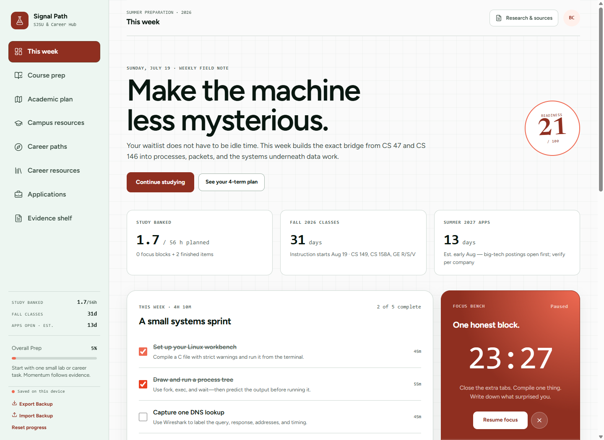

# Signal Path

I built this to run my degree plan and job search from one browser tab.

**[Open the live app →](https://bryancruzcb.github.io/signal-path/)**

Course-prep labs for waitlisted systems courses, a four-term academic plan, six career tracks, a curated resource stack, and a Summer 2027 internship application tracker. Everything persists in the browser's local storage — no account, no backend, no analytics. About 7,000 lines of TypeScript across ten independently persisted storage keys, with a JSON export/import file as the only backup.

## What was actually hard

**Keeping the focus timer honest.** A `setInterval` countdown drifts badly in a background tab, where browsers clamp timers to roughly one tick per minute, and it loses the session outright if you close the tab mid-block. This one derives the countdown from a wall-clock deadline instead, so throttling can't stall it and a throttled tab snaps back to the true value on return via `focus` and `visibilitychange`.

On `beforeunload`/`pagehide` it writes the live remaining seconds straight to `localStorage` — React state can't flush during unload — or banks the whole session if the deadline already passed. That last path also nulls the deadline, so the `pagehide` that fires immediately after `beforeunload` can't count the same session twice. [`src/App.tsx:434-484`](src/App.tsx#L434-L484)

**Trusting an imported file as little as possible.** Import restores from a user-supplied JSON file, so every field is validated independently and bad fields are dropped rather than failing the whole import. A partially corrupt export restores the parts that are still well-formed and reports which ones came back. [`src/App.tsx:628-700`](src/App.tsx#L628-L700)

**Labelling evidence by strength.** Every course claim carries the source it came from, tagged official / syllabus / student / inferred. Course access and recruiting practices change, so claims are labelled to be re-verified rather than trusted.

<!-- SCREENSHOT: capture the "This week" view at 1440px wide with the Focus Bench timer mid-session
     (a few minutes on the clock, not 25:00) and at least two course-readiness rows filled in.
     Save as docs/images/this-week.png and replace this comment with:

-->

## Views

- **This week** — weekly systems sprint, Focus Bench timer, course readiness, and the active career lane at a glance
- **Course prep** — CS 149 (Operating Systems) and CS 158A (Computer Networks) module explorer with runnable labs and mastery tracking
- **Academic plan** — known-courses checklist, four-term timeline, skill constellation, and an electives decision table
- **Campus resources** — SJSU portal (primary: MyProgress, catalog, prerequisites, career center, Handshake) with an SDSU portal toggle (secondary/transfer resources and events)
- **Career paths** — six lanes with verdicts, roadmap phases, milestones, and flagship project briefs
- **Career resources** — searchable, filterable resource stack with per-resource progress
- **Applications** — recruiting signals, a local job tracker, weekly outreach cadence, and reusable outreach templates
- **Evidence shelf** — the research behind the course claims, labeled by evidence strength (official / syllabus / student / inferred)

Progress switches lanes without losing state: tasks, resource progress, milestones, and applications are stored per path and can be exported as JSON from the sidebar.

## Run locally

Prerequisite: Node.js 20.19+ or 22.12+.

```bash
npm install
npm run dev
```

Open the URL Vite prints, usually `http://localhost:5173`.

```bash
npm run lint     # oxlint
npm run build    # tsc + vite build
npm run preview  # serve the production build
```

## Project structure

- `src/App.tsx` — all eight views, sidebar navigation, hash routing, and local persistence
- `src/App.css` — the oklch design system and responsive layout
- `src/data/careerPaths.ts` — six path profiles, curricula, resources, projects, and market signals
- `src/data/sjsuData.ts` — SJSU course-prep modules, academic roadmap, electives, and evidence sources
- `src/data/roadmap.ts` — SDSU campus resources and career events (secondary campus view)
- `PRODUCT.md` / `PROJECT_BRIEF.md` — product intent and design principles

Research was last reviewed in July 2026. Course access and recruiting links change; the Evidence shelf keeps sources labeled so details can be re-verified before acting.
